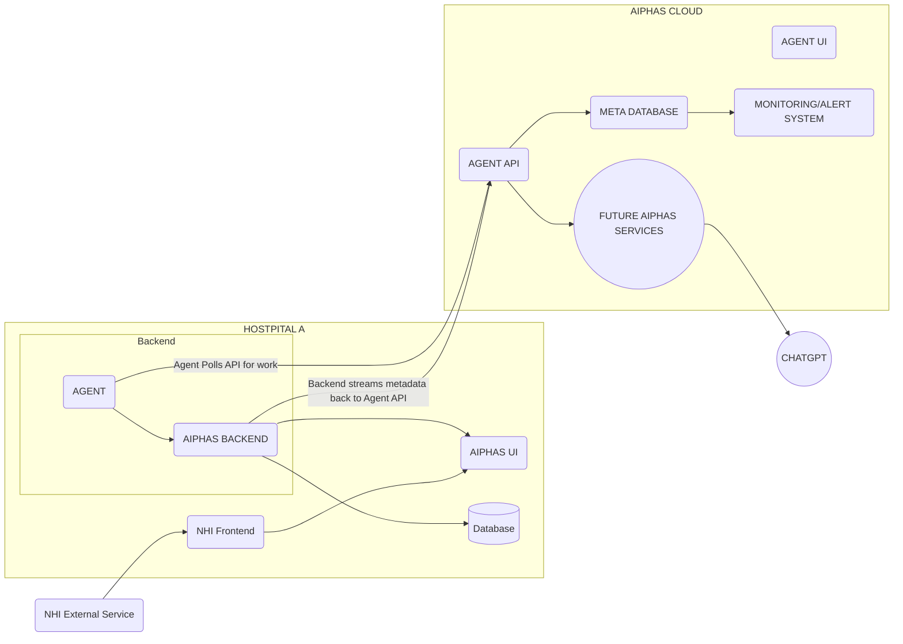

# Hybrid Architecture PoC
This is a poc to simulate hybrid architecture written by [Monte Carlo Data](https://www.montecarlodata.com/blog-data-software-as-a-service-the-case-for-a-hybrid-deployment-architecture/) to test the feasibility of a software agent running in a customer-dedicated, isolated VPC.

## Proposal
1. Createa dockerized MERN application to simulate customer's environment.
2. Create a grpc service and agent along with a graphQL interface as a control plane for customer metadata and service healthchecks.
3. Deploy the two applications in two separate VPC's with k8s.

## Diagram

